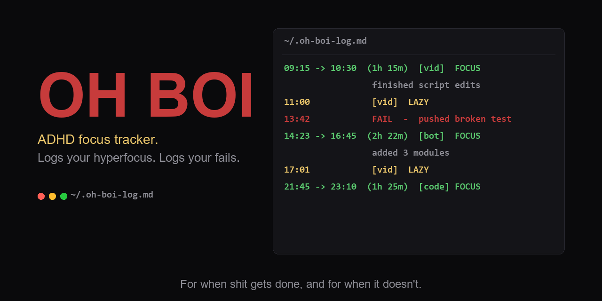

# oh-boi-cli

> For when shit gets done, and for when it doesn't.

ADHD focus tracker and fail logger for Windows / PowerShell. Logs your hyperfocus sessions, your low-energy moments, and your "OH BOI I just broke prod" fails to a plain markdown journal you can grep, share, or reuse however you like.

Made by [Doombringerz](https://doombringerz.com), self-proclaimed Laziest YouTuber in the Gaming Universe.

## Why

ADHD-shaped workflow alternates between "doing absolutely nothing" and "OH BOI does shit get done." This tool tracks both honestly so you see the rhythm instead of pretending you're a 9-to-5.

The `fail` command is a bonus: log the moments where things go wrong. Useful as raw material if you do devlogs, or just to have something to laugh at later.

## Install

One line:

```powershell
irm https://raw.githubusercontent.com/Doombringerz/oh-boi-cli/main/install.ps1 | iex
```

Or clone and source manually:

```powershell
git clone https://github.com/Doombringerz/oh-boi-cli.git $env:USERPROFILE\.oh-boi-cli
. $env:USERPROFILE\.oh-boi-cli\ohboi.ps1
```

Then add the dot-source line to your `$PROFILE` to make it persistent across sessions.

## Use

```powershell
ohboi start bot                       # Start a focus session, tagged "bot"
# ... do the work ...
ohboi end "shipped the migration"     # End the session, note what got done

ohboi lazy vid                        # Log a low-energy moment
ohboi fail "deployed without backup"  # Log a fail

ohboi list 5                          # Show last 5 entries
ohboi stats                           # Weekly summary
ohboi share                           # Copy last entry to clipboard
ohboi help                            # Show usage
```

Tags are free-form. Suggested: `game`, `bot`, `vid`, `code`, `biz`. Use whatever fits your workflow.

## Where the log lives

```
%USERPROFILE%\.oh-boi-log.md
```

Plain markdown. Open it in Obsidian, Notion, VS Code, anywhere. Sync it with whatever you sync everything else with.

## Example log

```markdown
# OH BOI Log

For when shit gets done, and for when it doesn't.

- **2026-05-17 09:15** to **10:30** (1h 15m) [vid] FOCUS, finished script edits
- **2026-05-17 11:00** [vid] LAZY, couldn't focus after coffee
- **2026-05-17 13:42** FAIL, deployed migration to prod without backup
- **2026-05-17 14:23** to **16:45** (2h 22m) [bot] FOCUS, added 3 new modules
```

## Requirements

- PowerShell 7+ recommended (PS 5 works for basic commands)
- Windows (Linux / macOS support possible if anyone asks loud enough)
- `git` for the clone-based install

## License

MIT, see [LICENSE](LICENSE).

## Related

- [doombringerz.com](https://doombringerz.com)
- [win-rice-doombringerz](https://github.com/Doombringerz/win-rice-doombringerz), companion terminal setup
- [doombringerz-vault](https://github.com/Doombringerz/doombringerz-vault), companion Obsidian starter vault
